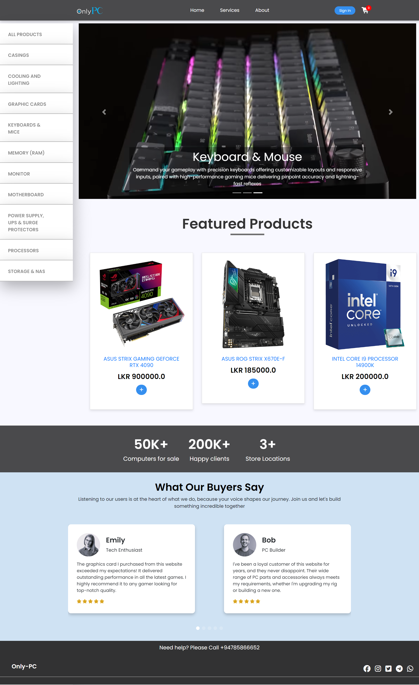

## Only PC - DEA Group Project

---

#### Get started

To get started with this project, you can follow these steps:

1. Clone this repository to your local machine using the following command:

   ```bash
   git clone https://github.com/tdulshan3/eCom-web-app-DEA.git

2. To set up this project, please follow these steps:

   **Download and Extract Requirements:**

   Download the `requirements.zip` file provided. After downloading, extract its contents. You will find two files: an "upload" folder and a "test.sql" file.

   **Create Database in phpMyAdmin:**

   Open phpMyAdmin in your web browser. Create a new database named "test".

   **Import SQL File:**

   Inside phpMyAdmin, navigate to the "test" database. Then, select the "Import" tab. Choose the "test.sql" file you extracted earlier and import it into the "test" database.

   **Copy and paste Files:**

   Locate the build folder in your project directory. Inside the build folder, find the "web" directory. Copy and paste the upload folder inside of it.

3. Run the Project:
Now that you've set up the database and replaced the webpages directory, you're ready to run the project. Navigate to the project directory and start the application as per the project's instructions.

Explore the Project:Once the project is running, explore its features and functionalities. You're all set!


---
#### Project Details

- Module Code: **SE 204.3**
- Module Name: **Development of Enterprise Applications**
- Year: **2024**
- Batch: **22.2**
- University: [NSBM Green University](https://www.nsbm.ac.lk/)


#### Features
- Online Shopping
- Role based authorization (Admin, Registered User, Non Registered User)
- Filtering System
- Cart and Chekout Process
- Responsive Design

#### Technologies Used

- [Java Development Kit 21](https://jdk.java.net/21/) *(JDK 21)*
- [Glassfish Web Server](https://glassfish.org/)
- [Java Servlets](https://www.oracle.com/java/technologies/java-servlet-tec.html)
- [JavaServer Pages / JSP](https://www.oracle.com/java/technologies/jspt.html)
- [JavaServer Pages Standard Tag Library](https://tomcat.apache.org/taglibs/standard/)
- [MySql](https://www.mysql.com/)
  
#### JS Libraries Used

- [Bootstrap](https://getbootstrap.com/docs/4.0/getting-started/introduction/)
- [jquery](https://releases.jquery.com/)
- [Swiper](https://swiperjs.com/)


Here is the screenshot that shows the E-commerce demo application in use.

<br>
Landing page

